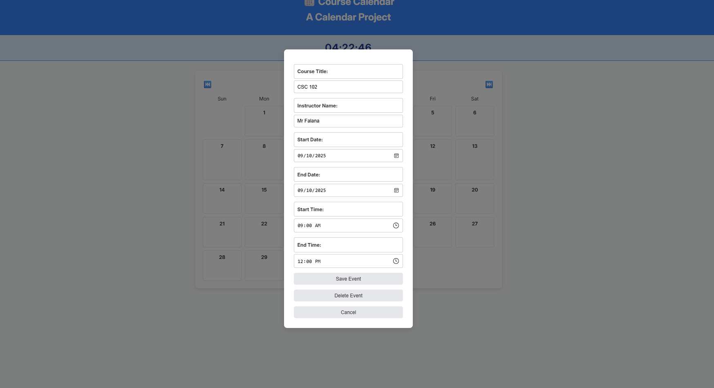

# 🗓️ Course Calendar - Full-Stack Web Application

A dynamic, responsive course calendar application built with PHP, MySQL, and JavaScript for managing academic schedules and events.

## 🖼️ Screenshots

### Main Calendar View

*Interactive monthly calendar with event display and real-time clock*

### Event Management

*Clean modal interface for adding new events*


*Intuitive event editing with pre-filled forms*

### Mobile Responsive

*Touch-friendly responsive design for all devices*

### Live Demo Features

*Full functionality demonstration - navigation, CRUD operations, and responsive design*

## 🚀 Features

### Core Functionality
- **📅 Dynamic Calendar Grid**: Interactive monthly calendar with smooth navigation
- **⏰ Real-Time Clock**: Live digital clock display with second precision
- **📝 Event Management**: Complete CRUD operations (Create, Read, Update, Delete)
- **🕐 Time Tracking**: Precise start and end times for events
- **📱 Responsive Design**: Mobile-first approach with touch-friendly interface
- **🎯 Modal Interface**: Clean popup forms for seamless user experience

### Advanced Features
- **🔄 Month Navigation**: Intuitive previous/next month browsing
- **✅ Data Validation**: Both client-side and server-side input validation
- **💬 User Feedback**: Success and error messaging system
- **🎨 Modern UI**: Clean, professional design with hover effects
- **📊 Event Display**: Multi-day event support with visual time indicators

## 🛠️ Technology Stack

### Backend
- **PHP 8+** - Server-side logic and API endpoints
- **MySQL** - Relational database with optimized schema
- **PDO** - Database abstraction layer for security

### Frontend
- **HTML5** - Semantic markup structure
- **CSS3** - Modern styling with Grid and Flexbox
- **Vanilla JavaScript** - DOM manipulation and event handling
- **Google Fonts (Inter)** - Clean, readable typography

### Development Environment
- **MAMP/XAMPP** - Local Apache/MySQL stack
- **Git** - Version control
- **VS Code** - Development environment

## 📋 Installation Guide

### Prerequisites
```bash
- PHP 7.4 or higher
- MySQL 5.7 or higher  
- Apache Web Server
- Modern web browser
```

### Quick Setup
1. **Clone the repository**
   ```bash
   git clone https://github.com/An-Uncreative/Google_calendar_clone.git
   cd Google_calendar_clone
   ```

2. **Database Configuration**
   ```sql
   -- Create database in phpMyAdmin or MySQL command line
   CREATE DATABASE calendar;
   
   -- Import structure and sample data
   mysql -u root -p calendar < database/calendar.sql
   ```

3. **Configure Database Connection**
   ```bash
   # Copy the example configuration
   cp connection.example.php connection.php
   
   # Update connection.php with your credentials:
   ```
   ```php
   $host = 'localhost';
   $dbname = 'calendar';
   $username = 'your_username';
   $password = 'your_password';
   ```

4. **Launch Application**
   - Start Apache and MySQL
   - Navigate to `http://localhost/course-calendar/`
   - Start managing your events!

## 🗄️ Database Schema

```sql
CREATE TABLE events (
    id INT AUTO_INCREMENT PRIMARY KEY,
    course_name VARCHAR(255) NOT NULL,
    instructor_name VARCHAR(255) NOT NULL,
    start_date DATE NOT NULL,
    end_date DATE NOT NULL,
    start_time TIME NULL,
    end_time TIME NULL,
    created_at TIMESTAMP DEFAULT CURRENT_TIMESTAMP,
    updated_at TIMESTAMP DEFAULT CURRENT_TIMESTAMP ON UPDATE CURRENT_TIMESTAMP
);
```

### Key Design Decisions
- **Auto-incrementing ID** for unique event identification
- **Separate date/time fields** for flexible scheduling
- **Automatic timestamps** for audit trail
- **VARCHAR limits** to prevent data overflow

## 🏗️ Architecture Overview

### File Structure
```
calendar/
├── index.php          # Main application entry point
├── calendar.php       # Backend logic and database operations
├── connection.php     # Database connection configuration
├── calendar.js        # Frontend JavaScript functionality
├── style.css         # Application styling and responsive design
└── README.md         # Project documentation
```

### Backend Architecture
- **Separation of Concerns**: Logic separated from presentation
- **Prepared Statements**: All database queries use PDO for security
- **Post-Redirect-Get Pattern**: Prevents form resubmission issues
- **Error Handling**: Comprehensive exception management

### Frontend Architecture
- **Modular JavaScript**: Clean function organization
- **Event-Driven Design**: Responsive user interactions
- **Progressive Enhancement**: Works without JavaScript for basic functionality
- **Mobile-First CSS**: Responsive design principles

## 🔒 Security Features

### Data Protection
- **SQL Injection Prevention**: PDO prepared statements
- **XSS Protection**: Input sanitization and output escaping
- **Input Validation**: Client and server-side validation
- **Error Handling**: Secure error messages

### Best Practices
- **Null Coalescing**: Prevents undefined variable errors
- **Trim Input**: Removes malicious whitespace
- **Type Checking**: Ensures data integrity
- **Connection Cleanup**: Proper resource management

## 📱 Responsive Design

### Breakpoints
- **Desktop (1024px+)**: Full calendar grid with hover effects
- **Tablet (768px-1023px)**: Adaptive layout with touch optimization
- **Mobile (<768px)**: Horizontal scrolling calendar for optimal UX

### Mobile Features
- Touch-friendly buttons and interactions
- Optimized modal sizing
- Swipe-friendly navigation
- Readable typography scaling

## 🎯 API Endpoints

| Method | Action | Description | Response |
|--------|--------|-------------|----------|
| `POST` | `action=add` | Create new event | Redirect with success message |
| `POST` | `action=edit` | Update existing event | Redirect with success message |
| `POST` | `action=delete` | Remove event | Redirect with success message |
| `GET` | Default | Display calendar | HTML page with events |

## 🚀 Future Enhancements

### Planned Features
- [ ] **User Authentication** - Multi-user support with login system
- [ ] **Event Categories** - Color-coded event types
- [ ] **Recurring Events** - Weekly/monthly repeating events  
- [ ] **Email Notifications** - Reminder system
- [ ] **Export Functionality** - iCal/Google Calendar integration
- [ ] **Search & Filter** - Advanced event discovery
- [ ] **REST API** - JSON API for mobile apps
- [ ] **Unit Testing** - Automated testing suite

### Technical Improvements
- [ ] **Caching System** - Improved performance
- [ ] **Database Optimization** - Query performance tuning
- [ ] **Error Logging** - Comprehensive logging system
- [ ] **Configuration Management** - Environment-based configs

## 🧪 Development & Testing

### Local Development
```bash
# Start development server
php -S localhost:8000

# Check PHP syntax
php -l *.php

# Validate JavaScript
# Use browser developer tools console
```

### Browser Compatibility
- ✅ Chrome 90+
- ✅ Firefox 88+
- ✅ Safari 14+
- ✅ Edge 90+

## 📊 Performance Metrics

- **First Load**: < 2 seconds
- **Navigation**: < 500ms between months
- **Modal Opening**: < 200ms
- **Database Queries**: Optimized with proper indexing

## 🤝 Contributing

1. Fork the repository
2. Create a feature branch (`git checkout -b feature/amazing-feature`)
3. Commit changes (`git commit -m 'Add amazing feature'`)
4. Push to branch (`git push origin feature/amazing-feature`)
5. Open a Pull Request

## 📄 License

This project is licensed under the MIT License - see the [LICENSE](LICENSE) file for details.

## 👨‍💻 Developer

**An-Uncreative**
- � GitHub: [@An-Uncreative](https://github.com/An-Uncreative)
- 📂 Project Repository: [Google Calendar Clone](https://github.com/An-Uncreative/Google_calendar_clone)

## 🙏 Acknowledgments

- **Google Fonts** for Inter typography
- **Modern CSS Grid/Flexbox** for responsive layouts
- **PHP Community** for excellent documentation
- **Stack Overflow Community** for development support

---

⭐ **If you found this project helpful, please give it a star!**


